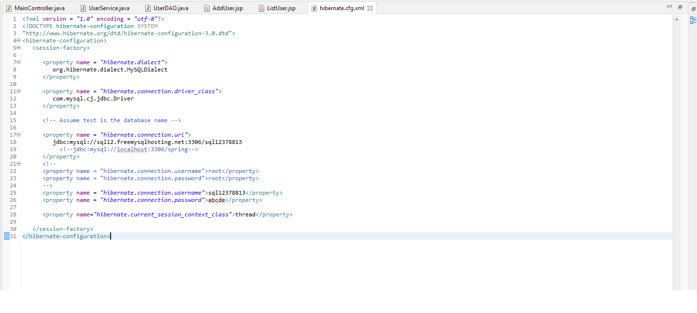
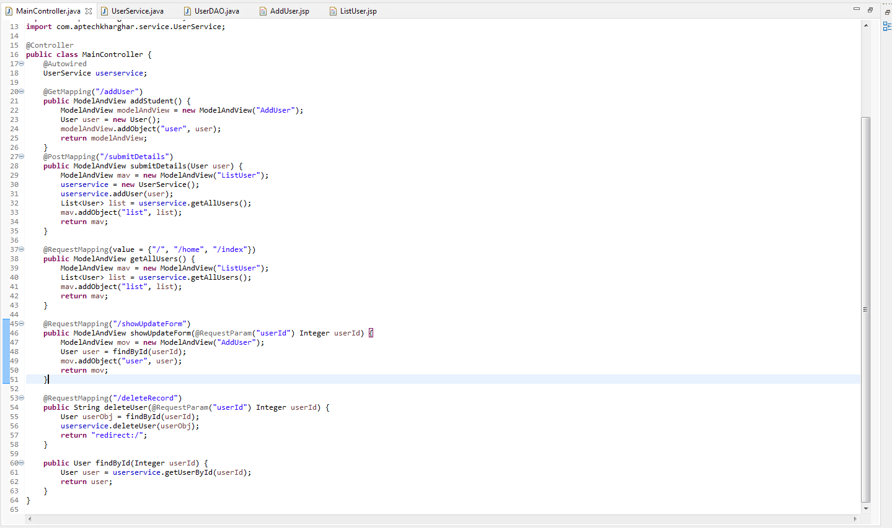

# SpringMVCHibernateUser
A simple web application created using Spring MVC Hibernate Maven that performs CRUD Operations on User
# Some Code
## DAO

## Hibernate Config File
### I have used freemysqlhosting.net instead of mysql or aws

## Controller

# Screenshots
## Add A User

## Main Page Where Update and Delete Operations can be performed

## Update A User

